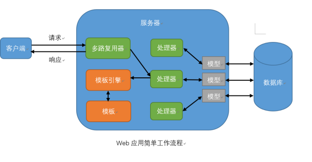

# Web应用工作原理


# 示例
```
package main
import "net/http"
import "fmt"
func handler(w http.ResponseWriter, r *http.Request) {
    fmt.Fprintln(w, "Hello World!", r.URL.Path)
}
func main() {
    http.HandleFunc("/", handler)
    http.ListenAndServe(":8080", nil)
}
```

Go build  
./xxx  
http://localhost:8080